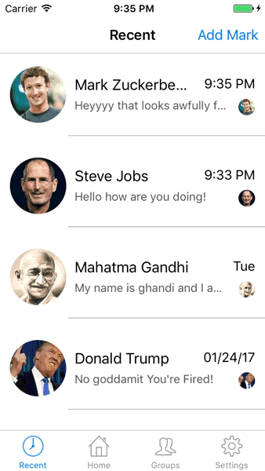
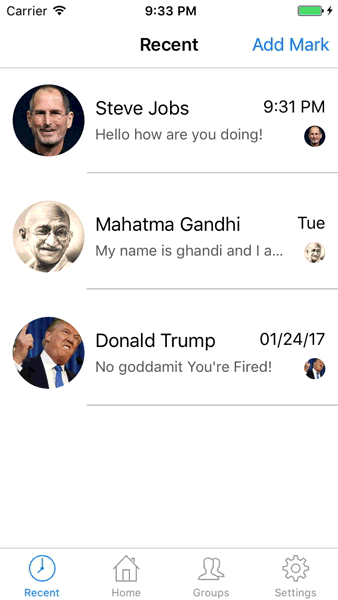

<h1>Facebook Messenger Application</h1>

This will serve as an introduction to learning iOS development with 
swift 3 by attempting to replicate one of the worlds most poular application, the facebook messenger

This application will serve as an introduction to CoreData as well by storing the "Mock Messages" in the database. This app demonstrates sorting the chats with NSSortDescriptors and NSPredicate.

<table>
  <tr>
    <th>
      <h2>Simulate Chatting Animations</h2>
    </th>
    <th>
      <h2>Simulate receiving a new message animation</h2>
    </th>
  </tr>
  
  <tr>
    <th>
      
    </th>
    <th>
      
    </th>
  </tr>
</table>

